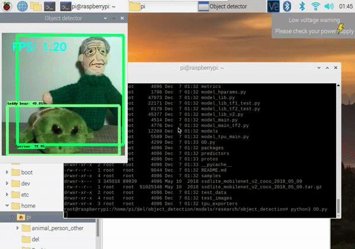

# Hi all, REAME and all comments FOR THIS REPOSTITORY HERE:
https://oleksandrg.medium.com/create-simple-recognition-object-detection-in-the-live-time-on-the-raspberry-pi-version-2-a574f84394c1

# Result:

# 8 HOW TO IMPROVE THIS RESULT HERE:
https://oleksandrg.medium.com/create-fast-recognition-object-detection-in-the-live-time-part-3-2d4772175388

# Also
If you were interested in this code, please put a star *.
Also, if you were interested in my article, please subscribe to my blog
https://oleksandrg.medium.com/

Thank you :)
